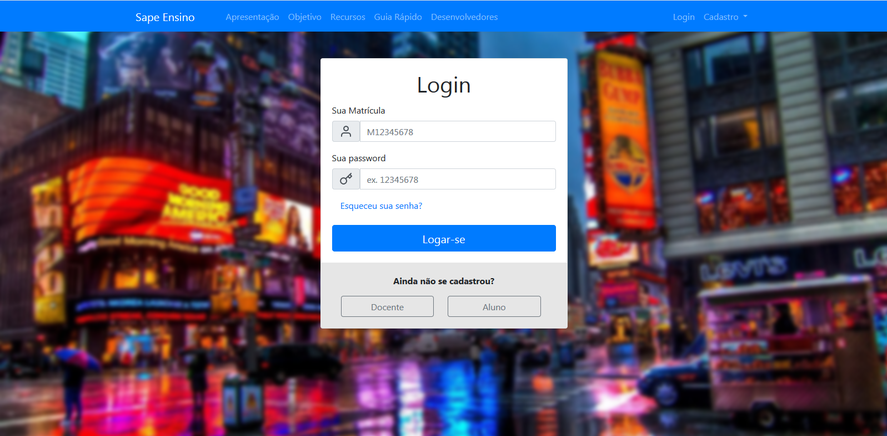
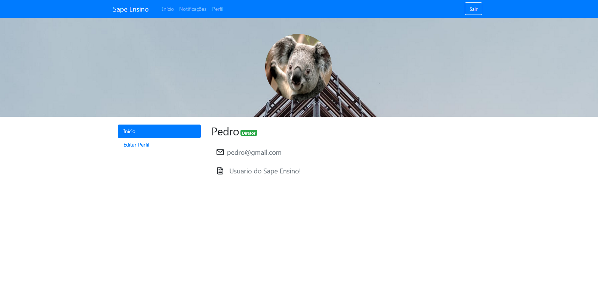
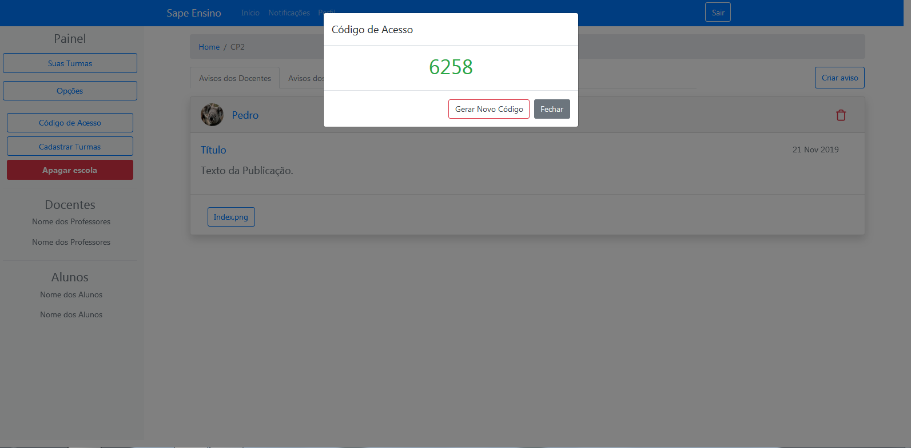
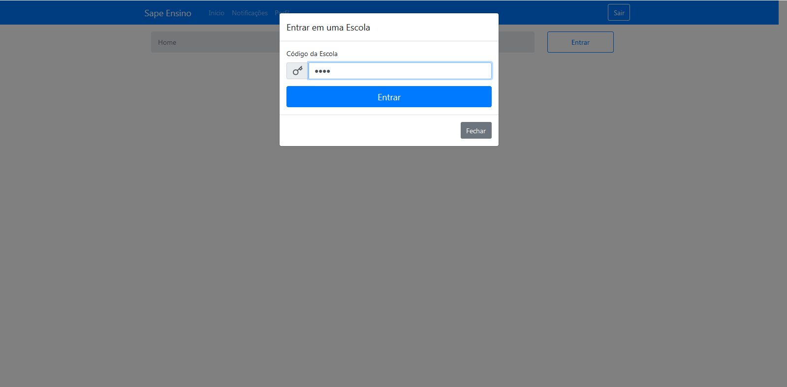

# Manual de instruções
>Nesse manual, iremos ensinar a usar as principais ferramentos do sistema

## Cadastro
> Para efetuar seu cadastro bastar clicar no botão "Cadastro" no canto superior direito da tela e escolher a forma de cadastro que você deseja.
> O SAPE suporta dois tipos de cadastro: Docente, podendo ser diretor ou professor, e aluno. Dependendo do seu cadastro você terá diferentes permissões dentro do site.
> Diretor: O diretor pode criar uma escola dentro do site, dentro da qual irá conter as turmas, além de poder publicar anúncios que poderão ser visualizados por todos aqueles que estão inseridos na escola.
>Professor: O professor poderá criar turmas referentes a sua própria disciplina, onde poderá gerenciar e publicar conteúdos dos mais diversos formatos.
> O aluno, por sua vez, poderá entrar em escolas e turmas, falicitando assim a comunicação entre docentes e alunos

## Login
> Após fazer o cadastro você será automaticamente redirecionado para a página de login, onde poderá finalmente ter acesso ao site. Caso você já seja cadastrado basta clicar no botão "Login" no canto superior direito da página inicial.

## Perfil
> Após fazer o login você poderá personalizar a sua página de perfil e editar algumas informações facilmente. Bastar clicar no botão "Editar perfil" no canto esquerdo da tela e você será redirecionado para a página de perfil.

## Criar escolas
> Ao fazer login como "Diretor" você terá permissão para criar escolas e isso pode ser feito de forma simples clicando no botão "Opções" na página do diretor e logo após clicar no botão "Cadastrar escola".

## Criar turmas
> A conta de diretor também permite criar e gerenciar turmas, as quais possuirão disciplinas.

## Criar disciplina
> Ao efetuar login como "Professor" você terá permissão para criar disciplinas, que estarão contidas dentro de turmas, que por sua vez estarão contidas em escolas.

## Publicações dentro da disciplina

## Publicações gerais
> Ao criar a escola, o diretor poderá publicar anúncios, além de anexar arquivos de diversos formatos. Os anúncios feitos na escola poderão ser visualizados por todos aqueles que tiverem contidos nela.
> Para fazer uma publicação basta clicar no botão "Criar anúncio"

## Entrar na escola
> Ao criar uma conta de "aluno" ou "Docente-professor" você poderá entrar na escola e desfrutar das funcionalidades do SAPE. Basta clicar no botão "Entrar" e inserir o código de acesso que lhe foi dado.

